Overview
===

We currently use one lighting system across all of Roblox, which is using voxels and is updated incrementally/lazily on CPU. It has served us well over the last 4 years, but it needs an update to match the future vision. Lighting is complicated - we should be careful when selecting the next generation technology, as there are many factors/tradeoffs to consider. Two future systems have been prototyped to help guide our decision, which will be discussed further in this document; we’ll call them “Voxels” and “Shadow maps”. It’s important to understand how both of them work to understand the limitations. There’s a [summary table](#summary) at the end.

This document has a number of screenshots; the layout is always such that the screenshot on the left is using voxels, and the screenshot on the right is using shadow maps.

Implementation - voxels
===

This is a significant evolution of our existing voxel system. First, the world data is voxelized into a set of voxel grids - each grid is centered around the character and has increasing voxel sizes, e.g. all the way from 1 stud to 16 studs (5 grids in total). Each voxel contains occupancy information (0-100% full). After this, we compute lighting data for each voxel in each grid, based on the occupancy in each voxel, and on the light sources / sun light direction. All of the above happens on the GPU, as CPU is not fast enough to update so many voxels at such a high density.
 
The system stores all data in voxels, specifically for each voxel we have:
* Occupancy (multiple values describing how full each voxel is)
* Skylight (how much of the sky is visible from the voxel)
* Sun shadow (how much of the sun is occluded from the voxel)
* Light object color/cone (the approximation of the color/cone of impact of local light sources on the voxel)
 
This information is later used to compute the color of each pixel at a given resolution; screen resolution and voxel resolution can be controlled independently. Parts of voxel grid(s) can be updated each frame as lights/objects move.

Implementation - shadow maps
===

 This method uses rasterization to compute most of the shadow effects and executes in three phases. First, for each shadow casting light we update a shadow map by rendering triangles of objects into a texture from the viewpoint of the light (you can think of this as casting a lot of rays from the light source into the scene and remembering the intersection results). Second, we build a spatial acceleration structure that we insert each visible light object into, that is essentially a frustum-shaped voxel grid (aka froxel grid).

The grid covers the entire camera frustum, and within each froxel we record the list of all light objects that intersect it. Finally, when rendering the scene, for each pixel to compute the impact of all lights we look up the froxel our pixel is contained in, go over all lights, and for each light compute the impact of this light using the shadow maps build in step one to determine visibility.
 
The system stores all data in two structures:
* Shadow atlas (all shadow maps from visible lights, packed into one big texture)
* Light grid (froxel grid that can efficiently resolve a point in the camera into a list of lights)
 
The color of each pixel is computed dynamically and is not stored explicitly. Parts of the shadow atlas can be updated each frame as lights/objects move.

Performance - voxels
===

The voxel technique is fundamentally more scalable - as long as we’re willing to degrade the output quality, we can reduce the number of voxel grids, and update fewer voxels each frame (leading to “light lag” - light impact of the objects will update more slowly than the objects themselves). In terms of complexity, voxels decouple all three sources of complexity: geometrical complexity, light complexity, pixel count - geometrical complexity only impacts voxelization cost, so putting more objects doesn’t make anything else slower; light complexity only impacts light computation cost which does not depend on geometrical complexity *or* the number of pixels; finally, computation of the final pixel color is constant-time in the number of voxels/lights/parts, so we can scale the resolution independently without increasing the lighting performance impact.
 
You can think of voxel worst-case performance as O(G)+O(L)+O(P), where G is # of triangles (geometry complexity), L is # of lights, P is # of pixels.
 
Unfortunately, the peak performance of voxels is suboptimal because the number of voxels scales as N3, and GPUs aren’t ideally suited for the update techniques we have to use to keep performance manageable. Given enough research into GPU computing we should be able to offset the performance loss, but the current baseline cost can be pretty high.

Performance - shadow maps
===

For shadow maps, the technique is more GPU-friendly as it’s designed around rasterization which is what GPUs excel at; the shadow atlas update cost can be partially mitigated by caching/delaying updates (leading to “shadow lag”). For the shadow maps that we do update, optimizing the efficiency of geometry submission (including mesh level of detail) reduces the cost.
 
However, the baseline cost of shadow update in complex scenes is significant since it depends on both the amount of geometric detail and the amount of shadow-casting lights. For a moving light with a large radius inside the building, we have to re-render the entire building each frame to update the shadow information for this light; many moving shadow casting lights in a building result in poor performance (we can choose to update only some lights each frame, resulting in visual artifacts).
 
Additionally, the technique does not provide a way to separate resolution from the light count - for each pixel we have to recompute the influence of all lights that cover this pixel. This step also can not be cached, leading to performance issues on high resolutions in densely lit scenes - 20 overlapping lights in a room at 4K resolution might require 160M light evaluations).
 
You can think of shadow map worst-case performance as O(GL)+O(LP), where G is # of triangles (geometry complexity), L is # of lights, P is # of pixels.

Performance - evaluation
===

To put the theoretical results above in a more practical environment, here are results from some of the levels we have tested. These results use *existing* implementations - that have not been necessarily tuned for performance - and also assume *no* caching whatsoever, as if every light source/part in the world were moving.

Paris (sun shadows, very few non-shadow-casting lights)
---

<a href="images/paris_voxel.jpg">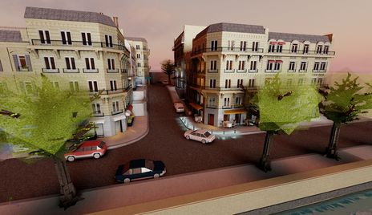</a> <a href="images/paris_shadowmap.jpg">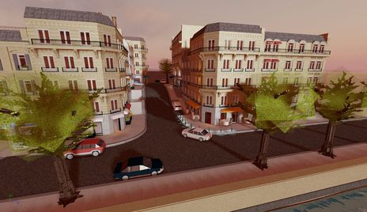</a>

* Voxels: 6 ms shadow update, 1.5 ms scene render
* Shadow maps: 1 ms shadow update, 2.4 ms scene render
* Baseline voxel shadow computation cost is larger since it’s not GPU-friendly

Caves (many shadow casting lights)
---

<a href="images/caves_voxel.jpg">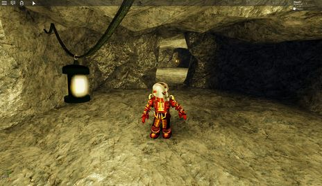</a> 

* Voxels: 7 ms shadow update, 0.9 ms scene render
* Shadow maps: 10 ms shadow update, 2.1 ms scene render
* A lot of geometry and moving lights make shadow map update expensive

Western (many shadow casting lights)
---

<a href="images/western_voxel.jpg">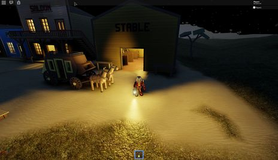</a> <a href="images/western_shadowmap.jpg">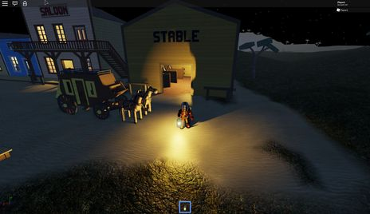</a>

* Voxels: 8 ms shadow update, 1 ms scene render
* Shadow maps: 15 ms shadow update, 2.5 ms scene render
* With moving light sources and large # of triangles, shadow map update becomes expensive

Lights (1000 non shadow casting lights)
---

<a href="images/manylights_voxel.jpg">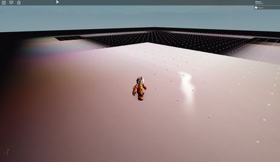</a> <a href="images/manylights_shadowmap.jpg">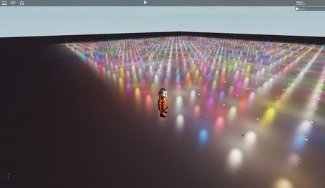</a>

* Voxels: 20 ms light update, 0.5 ms scene render
* Shadow maps: 0.5 ms light update, 5 ms scene render
* Cumulative volume of light-voxel overlap in this case makes voxel light update slow. Additionally, you can see that the approximation for "one light within each voxel" completely breaks down on this level for voxels that are in the near cascade.

Performance - conclusion
===

In general shadow maps seem to scale nicely to the workload, however two big concerning areas are:
 
1. Per-pixel cost grows as the resolution keeps bigger, making this solution only practical on average (1080p) resolutions; going beyond 1080p requires a *very* good GPU.
2. Shadow cost grows very quickly when many shadow-casting dynamic lights are close to complex geometry. This can be offset by better culling but remains a fundamental problem.
 
In contrast, voxel performance depends on the level contents much less, but has a much higher baseline. This can be offset by better GPU algorithms and by reducing the # of voxels.

Memory requirements
===

Memory requirements for shadow maps and voxels depend on the target quality.

For voxels, we store several textures for each voxel cascade; so the cumulative size depends on the number of cascades and the size of each cascade. We currently use 4 cascades (with voxel sizes 1..8) of 128x64x128 voxels in each, which adds up to 128 MB of VRAM used; we might want to have 2 more cascades (0.5 voxels and 16 voxels) or reconfigure the cascades, which would inflate the requirements up to 192 MB. We can reduce the number of cascades (removing some close cascades) on systems that are memory constrained, so realistically the minimum memory impact could be around 64 MB with two cascades (4..8) and around 96 MB with three cascades (4..16) which would allow for ~1k stud range with light/shadow data.

For shadow maps, we store the shadow map atlas and the froxel grid for light lookup; the latter is somewhat resolution dependent, and the shadow map atlas can be reduced in size if we want to reduce the shadow quality to improve memory/performance; the current setup uses 73 MB VRAM, the bulk of which (64 MB) is the shadow map atlas; we can reduce this and limit the number of shadowed lights or shadow quality. We are also considering some variants of the shadow maps that would require more storage to support translucency, which might mean that we'd need more memory for shadow maps (e.g. up to 130 MB or more). The minimum memory impact of the system can probably be reached if we reduce the shadow map atlas size and use a simpler variant, which would cost us around 25 MB total.

For comparison, the current voxel lighting system has two modes - high quality (PC) and low quality (Mobile); PC variant takes ~40 MB (24 MB RAM, 16 MB VRAM); mobile variant takes ~11 MB (6 MB RAM, 5 MB VRAM).

In essense, both techniques are reasonably close in terms of their memory impact, but shadow maps are somewhat more scalable for the same light/shadow range.

Mobile compatibility
===

Our audience is getting increasingly mobile; this means that we have to think of mobile when comparing these implementations. On a reasonably high end mobile device we should have enough API capabilities to implement both techniques, but of course they may or may not be practical from the memory and performance perspective.

Our existing voxel lighting system fits mobile really well - it supports many complex lighting features (light shadows, skylight, etc.) and runs most of the complex computations on CPU, thus having minimal requirements for the GPU performance and feature set. Since we still will have to maintain this system for the low end mobile and desktop market for the foreseeable future, we have several options in terms of mobile support:

* Keep existing system on mobile, new system will be desktop/console only. This means that a large segment of the user base will not have access to the new system.
* Improve existing system in a modest way (slightly lower voxel size, enhance voxel representation), use new system for desktop/console.
* Keep existing system on low-end mobile, find a way to scale down the new system so that it can work on high-end mobile.

In all of these cases we have to answer the question of content compatibility - one of the fundamental promises of our platform is "build content anywhere and run it anywhere", which means that we have to understand how well can content built for the new system look when using the old system, or some enhanced variant thereof.

This requires further investigation; on the outset it seems likely that new voxel solution is better in that it has a continuum of quality/behavior all the way from the existing voxel system to the highest quality of the new voxel system, whereas shadowmaps represent a more abrupt quality transition but have a higher chance of working in a limited capacity on high-end mobile devices.

Quality - lights
===

Shadow map solution provides the ground truth in terms of simulating the lights - on the screenshot with 1000 lights above that is made with shadow maps you can see that the specular highlights - modeled with a BRDF that is getting us basically light reflections - are perfectly preserved.
 
Voxel solution is fundamentally worse in that it approximates light influence at each voxel as if it just comes from one light, so in general you see the specular quality suffer; for example, here’s a screenshot with two lights (green & red) over a highly reflective surface:

<a href="images/specularrg_voxel.jpg">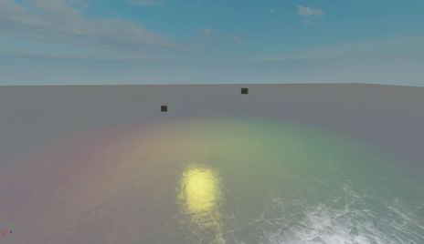</a> <a href="images/specularrg_shadowmap.jpg">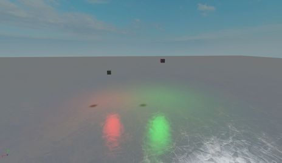</a>

As you can see, while in voxels away from the center of the camera you see distinct colors, in the area with specular highlights the colors merge in 1:1 ratio, producing yellow specular highlight even though there are no yellow lights in the scene. Shadow maps solution on the other hand models the light transport precisely.
 
In some cases the approximation we use produces results that very unconvincing, although we could improve this to some degree:

<a href="images/specularcurve_voxel.jpg">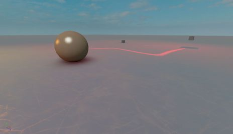</a> <a href="images/specularcurve_shadowmap.jpg">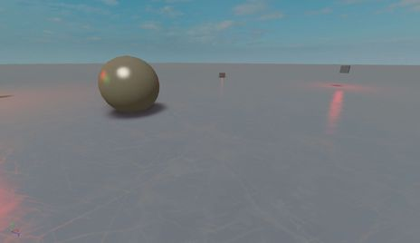</a>
 
You can see curved, elongated and miscolored specular highlights, and a few voxels below one of the parts are just missing light information. Same screenshot for shadow maps provides a much better result.
 
Quality - shadows
===

In general a defining quality of shadow maps is fidelity, and a defining quality of voxel shadows is softness. Shadow maps produce pretty crisp shadows, with minimum representable detail sufficiently high to render out a convincing character shadow. Our voxel shadow algorithm, on the other hand, is very good at producing really soft shadows, but since the smallest voxel size is 1 voxel, the shadows from small parts either don’t register at all, or have vastly incorrect shapes.
 
<a href="images/shadows_voxel.jpg">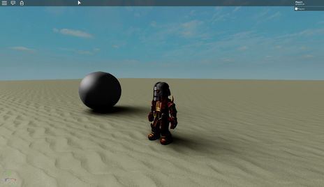</a> <a href="images/shadows_shadowmap.jpg">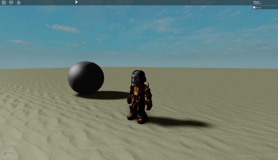</a>
 
For this reason we currently (in the production lighting system) use a shadow map variant to render shadows from the characters - this, however, is a duct tape solution in the sense that it only applies to the sun casting shadows from character, other light sources and/or objects aren’t affected.

Additionally, a key technique that makes voxels work reasonably fast is using voxel cascades; however, this means that occupancy data gets coarser the further away you are from the point of the scene interest; this means that shadow quality also gets worse as the distance between the shadow caster and the shadow receiver increases:

<a href="images/bridge_voxel.jpg">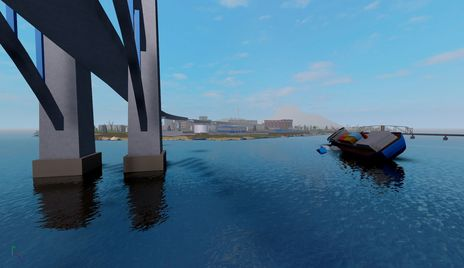</a> <a href="images/bridge_shadowmap.jpg">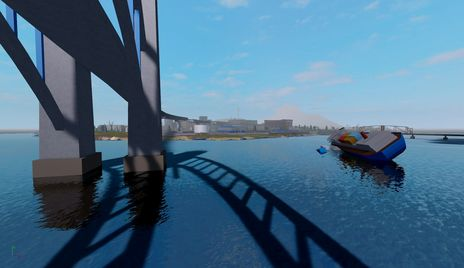</a>

In this case the size of the smallest voxel would have been enough to render a high quality shadow from the bridge, but the bridge is far away from the water surface so the bridge voxels are too coarse even if the voxels near the water surface are reasonably fine.
 
Quality - skylight
===

An important feature that we support in the voxel pipeline is computing the skylight factor - how much of the sky is  visible from the current voxel? This is used to blend between outdoor and indoor lighting conditions and is very effective at enhancing the lighting quality. In this level, it should be much brighter outside the house than it is inside the house, even in the areas that are in the shadow of the house. Our voxel solution computes the skylight factor and reproduces this well, however the shadow map version lacks the skylight factor which makes the picture dull.
 
<a href="images/skylight_voxel.jpg">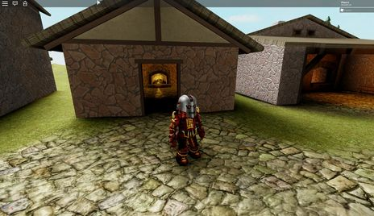</a> <a href="images/skylight_shadowmap.jpg">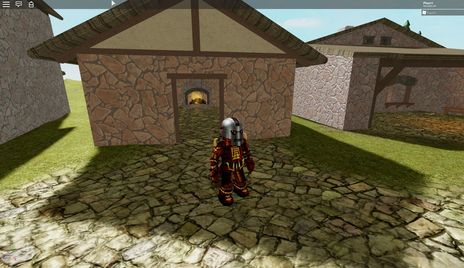</a>
 
Quality - geometrical fidelity
===

It’s worth noting the fundamental differences in geometry representation between voxels and shadow maps.
 
Voxels assume that all objects that the lighting engine supports can be “voxelized” - that is, for each voxel in the world there’s a fast way to compute the volume of intersection between that object and the voxel. This is analytically computable for primitive shapes, but complex objects like CSGs and MeshParts present a significant challenge in this area. Currently we rely on a crude convex decomposition and a set of hacks to voxelize these efficiently, that often result in visible artifacts. Shadow maps, on the other hand, use the same polygonal representation we use for rendering, thus they are able to represent the shapes of all objects perfectly:
 
<a href="images/csg_voxel.jpg">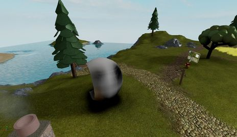</a> <a href="images/csg_shadowmap.jpg">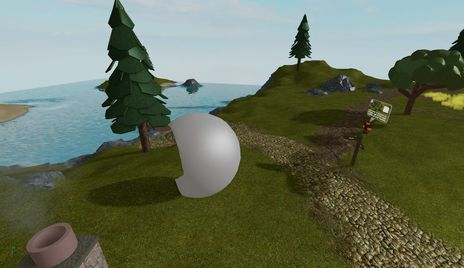</a>
 
Quality - light leaks
===

While the shape of the shadow is important, what perhaps is even more important is that pixels that should be completely invisible from the light source point of view are treated as such. When various approximations violate this, you get what’s called light leaking - visible strips of light, that are particularly problematic in high-contrast environments, such as being inside a building with bright sun outside. Here’s an example of a light leak:
 
<a href="images/leaks_voxel.jpg">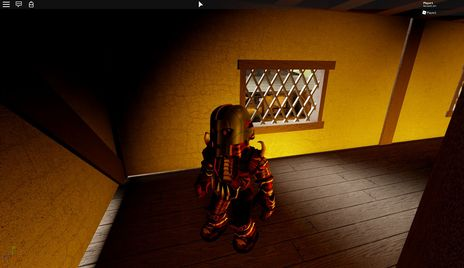</a> <a href="images/leaks_shadowmap.jpg">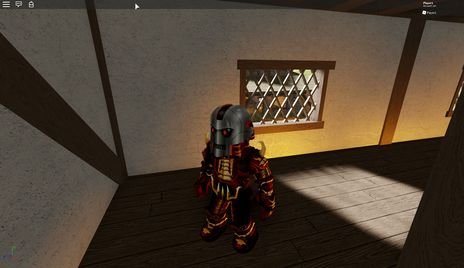</a>
 
The rough shape of the light cast through the window isn’t too objectionable here, but what *is* objectionable is the thin lit part of the floor right next to the wall. Shadow maps preserve the light occlusion much better.
 
For voxels there are multiple sources of leaking; we try to mitigate some of that by storing anisotropic occupancy - we store 3 values per voxel, signifying “how much matter is in the voxel projection along the axis A” for axes X/Y/Z; unfortunately, while this helps thin parts cast shadows regardless of their thickness, it can’t eliminate all sources of leaking. The only way for a part to guarantee that the light is completely blocked off is to make it twice as thick as a voxel is, so 2 studs. Additionally, leaking increases with the voxel size, which means that on lower quality levels and/or far away leaking is more pronounced.
 
Shadow maps aren’t completely leak proof but leaking is significantly less of a problem - with our shadow map solution a part that’s 0.4 studs thick will have no visible light leaking (a part that’s 0.2 studs thick can still leak a bit of light, which might be something we can improve in the future).
 
Quality - conclusion
===
Overall, shadow maps excel at most quality aspects; the only significant area of improvement is in figuring out a method of computing the skylight factor (it’s possible that this requires a hybrid technique that uses voxelization for skylight - which introduces some problems of the voxel pipeline -  or maybe there are alternative solutions to this problem). It would also be nice to be able to support very soft shadows with the same algorithm if the developer so desires, which might be achievable with some extensions to the shadow map algorithm.
 
Voxels have reasonable quality, but compared to shadow maps they face many issues, particularly with shadow fidelity and specular highlights; we’ll have to address both issues in some way to be able to ship voxel lighting because the current form of voxel lighting can’t deliver good looking player shadows, and using our current shadow solution means we still don’t get player shadows from light sources other than the sun, which seems incompatible with the future vision.

Vision - translucency
===

Rendering shadows is a reasonably well understood problem for opaque objects; however, translucent objects provide a new challenge - now light impact has to be diminished gradually as the light rays travel through transparent objects. Since our voxel solution works by propagating light through voxel cells using their occupancy value, it's not too hard to support translucent shadow casters, which can give us low frequency (soft) shadows from particle effects and other translucent objects in the scene, including self-shadowing for the particle effects themselves:

<a href="images/translucency_voxel.jpg">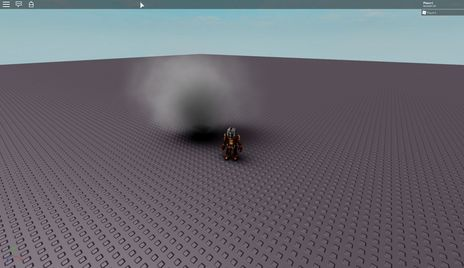</a> <a href="images/translucency_shadowmap.jpg">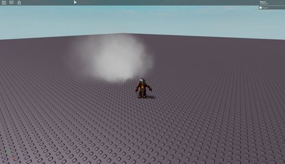</a>

Here's a video of this effect in motion:

For shadow maps this is not currently supported; this means that if we want to support particles or other transparent objects casting shadows, we may not be able to do this with shadow maps. There is some research for alternative shadow map representations that might serve this use case but it remains to be seen how effective that is.

Vision - vegetation
===

While shadow maps can’t represent translucency very well, what they can do is represent small features of objects (such as vegetation) regardless of whether they are modeled with geometry or with textures. Voxels aren’t small enough to serve this use case (and also it’s not easy to access the texture information since it requires precisely modeling the surface of the mesh instead of the volume). It seems unlikely that we can ever get good looking shadows from vegetation with voxels, whereas shadow maps can support this use case even with existing content, as shown on this screenshot:
 
<a href="images/vegetation_voxel.jpg">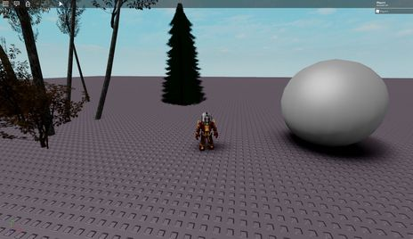</a> <a href="images/vegetation_shadowmap.jpg">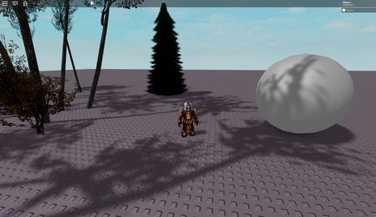</a>

Vision - self-illumination
===

Due to how voxels are implemented, it’s relatively simple to inject light from light sources of arbitrary shape and quantity into the grid without affecting other parts of the pipeline performance-wise; while you can add many light sources to the shadow maps, making lights with custom shapes has architectural and performance penalties. Specifically, what is much easier to do with voxels compared to shadow maps is true self-illumination: currently we support Neon material that “emits light”, but it doesn’t actually inject light onto other objects near it (which can be thought of a form of global illumination).
 
 <a href="images/glow_shadowmap.jpg">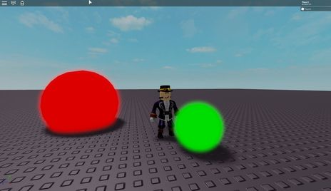</a>

As a developer you can simulate this by adding light sources, but it would be nice to support this automatically; shadow maps make it challenging to model this for all types of shapes that we have, but voxels by necessity support voxelization of all shapes and thus supporting light emission from self-illuminating parts is pretty straightforward.

Vision - global illumination
===

One big area that we see real-time engines increasingly moving towards solving is GI - global illumination - which means computing secondary light effects, such as light from a lamp bouncing two times off the walls to provide extra illumination for areas that aren’t directly visible to the light.
 
GI in Roblox is unprecedentedly complicated - most solutions to GI sacrifice at least one of (dynamic lights, dynamic geometry, real-time performance, large scenes, good results without tuning), whereas we need all of these. Interestingly, skylight factor and self-illumination mentioned above are all parts of a general GI solution.
 
It’s not clear which GI solutions will be practical within extremely lax content constraints we have; so far voxel-based GI seems more promising than other approaches when we need to consider all of the above.
 
Of course, having voxel-based GI doesn’t really enforce that direct lighting is computed using voxels - most research around voxel-based GI today implies using shadow maps to compute direct light visibility, and enhance the results using voxels.
 
We have done early experiments in this area but it’s too early to conclude whether or when this can be possible in Roblox.

Alternative approaches
===

There are some other approaches that are potentially interesting and are worth covering in this document:

* Deferred shading. A natural question is whether we should use deferred shading - it's important to note that this question is not very interesting for the considerations listed in this document. If we were to use deferred shading, we would still need the same shadow mapping technology, and due to the abudance of transparent objects at Roblox we would still need to support a forward lit pipeline for them, so it's really a question of "do we also need deferred shading to try to accelerate light processing for unshadowed lights". The only major advantage deferred shading has over our setup is better utilization of GPU during shading pass, which is worth looking into but does not seem a deal-breaker.

* Distance field tracing (aka voxel cone tracing). One significant issue with voxels as we implement them is that they give you a coarse volume-based scene representation *and* serve as an atomic unit of computation for light/shadow information. If we only keep the scene representation part, and convert it from volume-based to distance-based - meaning, if in every voxel we record the minimum distance from the voxel center to the scene - then we can compute shadows by tracing through this voxel grid for each pixel we want to compute data for. This may be a balance between shadow maps and voxels in terms of computational efficiency and quality, but it remains to be seen as to how efficient this can be. This approach is starting to get used in some games using Unreal Engine 4 (as they have a built-in distance field shadow solution), and there are several games that use this technology for parts of their lighting pipeline.

Finally, there is definitely room for some hybrid approaches. Effectively, we have many small mostly independent parts of the system - shadow map atlas, froxel grid for light lookup, cascaded voxel grids with occupancy, cascaded voxel grids with shadow data, cascaded voxel grids with light data, and potentially cascaded distance fields - it's reasonable to assume that there is some hybrid solution that can use different techniques for solving different problems.

For example, the main quality concern for shadow maps is their inability to implement skylight; since skylight can be implemented both by using a voxel grid with occupancy & shadow data, and using distance fields, it's reasonable to try to augment shadow maps with one of these solution to solve the skylight issue. This idea is interesting, but presents several challenges:

* By using a solution that has quality concerns as part of the hybrid, we'd inherit these issues in the resulting solution. For example, voxels are prone to light leaking and inaccurate geometrical representation, and both will be an issue even if we compute just skylight data from the voxel representation;

* By using two solutions with two different source representations, we pay extra memory and performance cost. For example, maintaining the voxelization pipeline in parallel with shadow maps implies we'll have to pay the cost of both voxelization and rasterization of all shadow casting geometry;

* Supporting each object in multiple techniques requires extra engineering/maintenance work - a hybrid solution will take more time to develop and more time to maintain in the future.

Summary
===

Based on the analysis above, we can summarize the tradeoffs that these two solutions provide. Cells using italic suggest that it might be possible to improve this area with further research. For the purpose of this table, Terrible < Poor < Okay < Good < Excellent.

|  | Voxels | Shadow maps |
|---|---|---|
| Performance: baseline | *Poor* | Excellent
| Performance: local lights | Okay | Good
| Performance: light shadows | Good | *Okay*
| Performance: resolution | Excellent | Okay
| Performance: geometry | Excellent |  Okay
| [Quality: lights](#quality---lights) | *Okay* | Excellent
| [Quality: macro shadows](#quality---shadows) | Good | Excellent
| [Quality: character shadows](#quality---shadows) | Poor | Excellent
| [Quality: skylight](#quality---skylight) | Excellent | *Terrible*
| [Quality: geometrical fidelity](#quality---geometrical-fidelity) | *Okay* | Excellent
| [Quality: light leaks](#quality---light-leaks) (&gt;2 studs) | Good | Excellent
| [Quality: light leaks](#quality---light-leaks) (&lt;2 studs) | Poor | Good
| [Vision: translucency](#vision---translucency) | Excellent | *Poor*
| [Vision: vegetation](#vision---vegetation) | Terrible | Good
| [Vision: self-illumination](#vision---self-illumination) | Excellent | Poor
| [Vision: global illumination](#vision---global-illumination) | *Okay?* | *Terrible*
