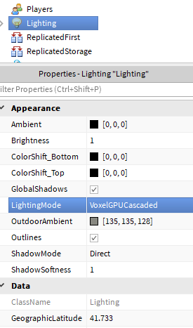

# Hack Week

We are always trying to improve Roblox by enhancing the fidelity and the scale of our simulation. In particular, our lighting engine has served us well over the years but limits the creative power of our developers, which is why over the last few years we have built several lighting prototypes during hack week:

| Hack Week 2015 (Next Generation Voxels) | Hack Week 2016 (Future Is Bright) |
|:-:|:-:|
|  |  |

The focus of these hack week projects was to push the boundaries of quality of content on Roblox; since it became clear that both represent significant improvements in the lighting technology that our community wants, we decided to invest more time in this.

# Exploration

Since we had two competing approaches, we could not just pick any one of them - we had to pick the right one. There are many factors to consider when building a new lighting engine:

* What kind of features can it have now?
* What kind of features can become possible as future extensions?
* How well does the engine perform on existing content?
* How well does the engine perform in extreme cases?
* What is the range of hardware the system can run on?

We tried to answer these questions and more by taking the code built during the hack weeks and developing it further to incorporate existing Roblox features as well as implementing some possible future extensions. Both approaches were integrated into one build that made it easy to compare the quality and performance on the same levels on the same hardware.

Based on this exploration, we have created a comparative analysis document that we want to share:

[Comparison between two new lighting engines with screenshots](compare)

After building this out, it became obvious that this is a tradeoff - each system has some nice properties that the other system doesn't, and we are still debating internally which system we should go with. This is a hard decision because we have to balance many variables and pick the best system that can serve us well for years to come.

# Prototype

In the spirit of transparency, we decided that instead of just making this decision ourselves we should also gather feedback from our community. We could just share the document and let you pick, but there are a lot of subtleties that you can only really notice when trying to build content for new systems, which is why instead we want to share the prototype build with you:

- [Download Windows build (.zip, ~120 MB)](https://github.com/Roblox/future-is-bright/releases/download/v10/future-is-bright-v10.zip); updated 12/6/2017 (v10)
- [Download macOS build (.zip, ~120 MB)](https://github.com/Roblox/future-is-bright/releases/download/v10/future-is-bright-v10.zip); updated 12/6/2017 (v10)

This is a custom build of Roblox Studio. Make sure to copy the folder from this .zip to your computer before running the build inside - don't run directly from .zip. The Windows build requires Windows 7 (or higher) and a mid-tier DirectX 10 compatible GPU - this does *not* mean that either lighting engine can only work on these systems, but limiting the supported hardware for the prototype allows us to iterate much faster and release the prototype to you much sooner. The Mac build requires Metal and a recent macOS release (there may be issues on early OS versions such as OSX 10.11).

Note that the build has not been optimized; performance of both engines can and will be improved significantly, both for the highest quality level and for the lowest quality level.

The build has three lighting engines built in, that you can switch between with Lighting.LightingMode property:

* VoxelCPU - the current voxel engine (4^3 voxels);
* VoxelGPUCascaded - the new voxel engine from "Next Generation Voxels" video (1^3 voxels and other improvements);
* ShadowMap -  the new shadow map-based engine from "Future Is Bright" video.

There are some other properties you might want to experiment with, such as Lighting.ShadowSoftness/Light.ShadowSoftness and Light.ShadowCutoff (disables shadows for parts really close to the light). The build also uses an experimental High-Dynamic Range implementation, which means that for both new lighting engines you can use values for light brightness that exceed 1; if you have existing content with high Brightness values you might have to adjust these for it to look better.

We are excited to see what you build and hope that you will help us make the right choice by sharing the content you build and the problems you encounter (you can [report issues on GitHub](https://github.com/Roblox/future-is-bright/issues)).

# Results

We released the prototype build on July 22nd and the response has been nothing short of astounding. [Here are some of the screenshots that Roblox developers shared with us in 60 hours since we released the build](results).
