We released the prototype build on July 22nd and the response has been nothing short of astounding. Here are some of the screenshots that Roblox developers shared with us in 60 hours since we released the build. (all screenshots are clickable)

<a href="images/results_01.jpg">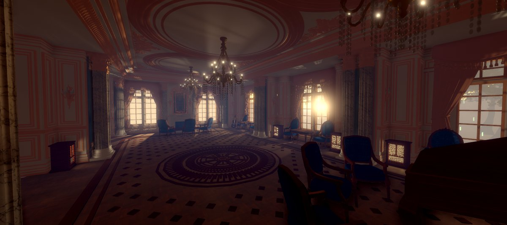</a>

<a href="images/results_02.jpg">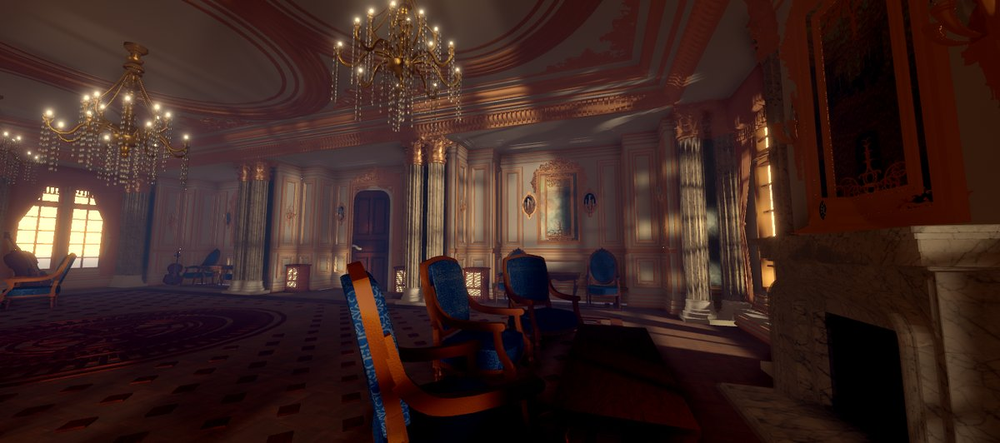</a>

<a href="images/results_03.jpg">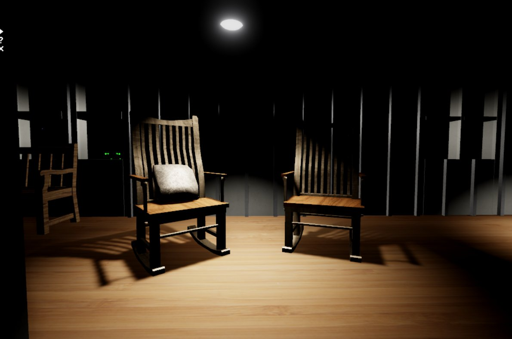</a>

<a href="images/results_04.jpg">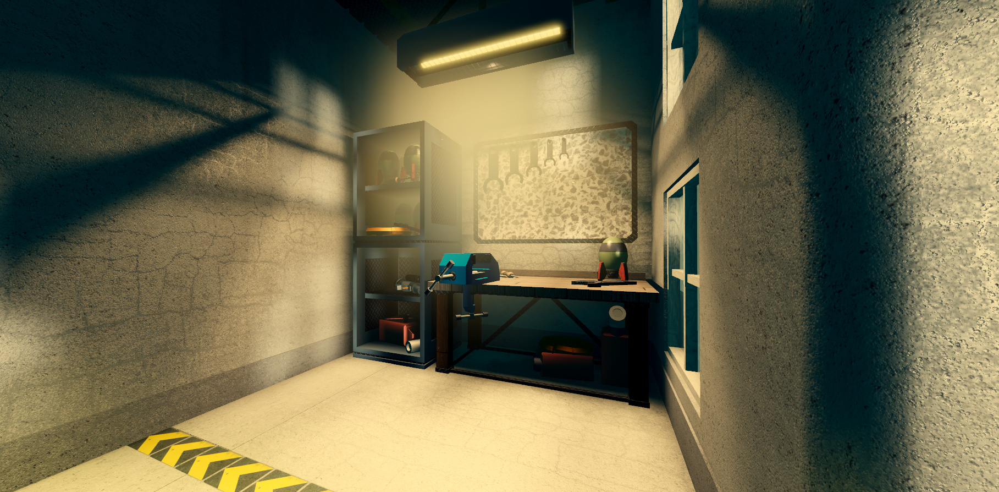</a>

<a href="images/results_05.jpg">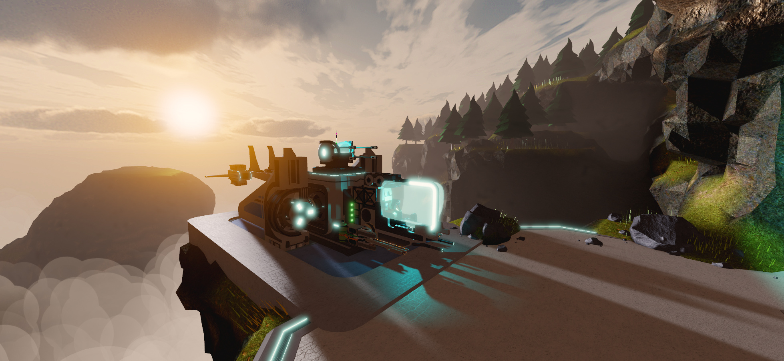</a>

<a href="images/results_06.jpg">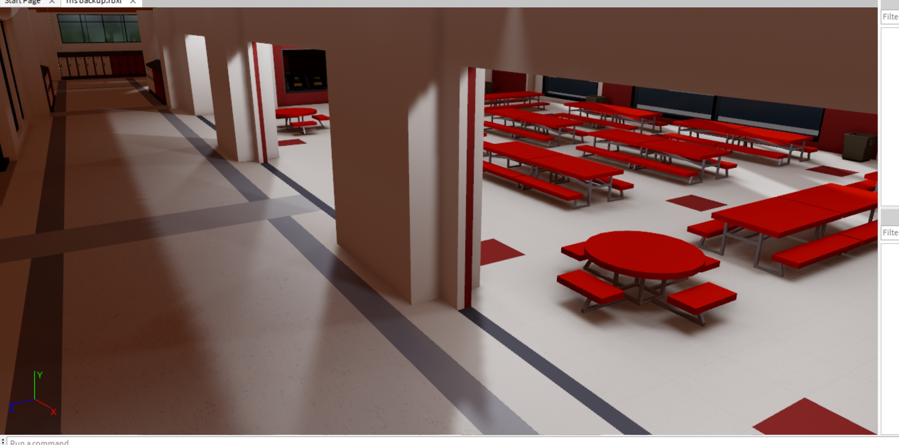</a>

<a href="images/results_07.jpg">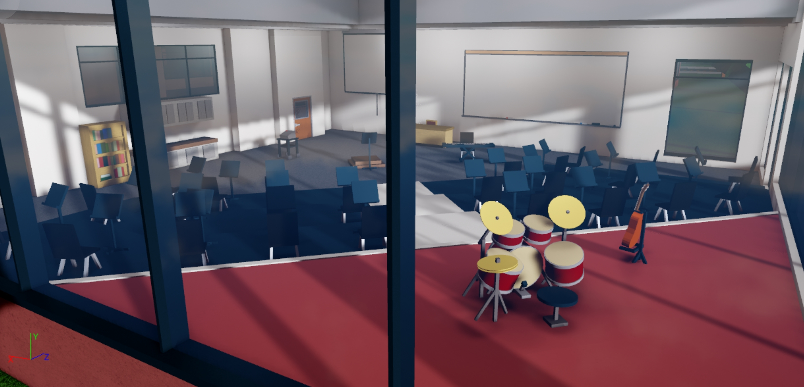</a>

<a href="images/results_09.jpg">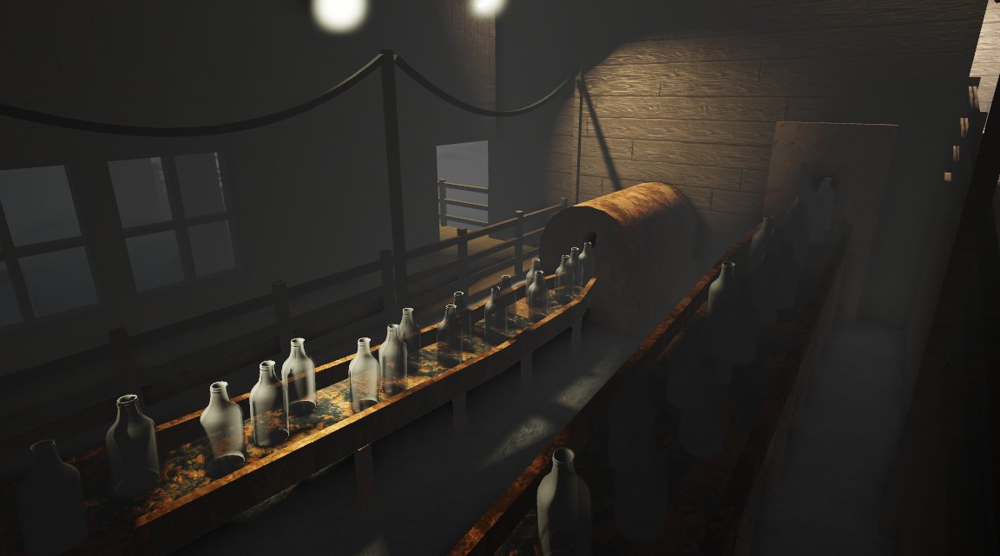</a>

<a href="images/results_10.jpg">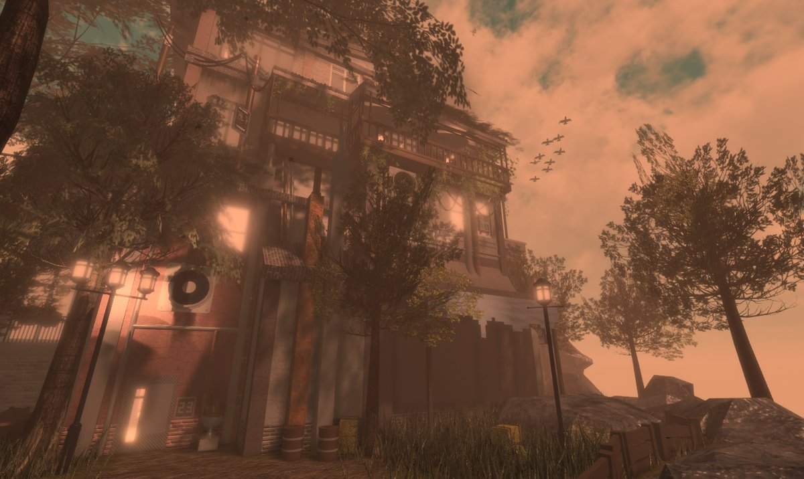</a>

<a href="images/results_11.jpg">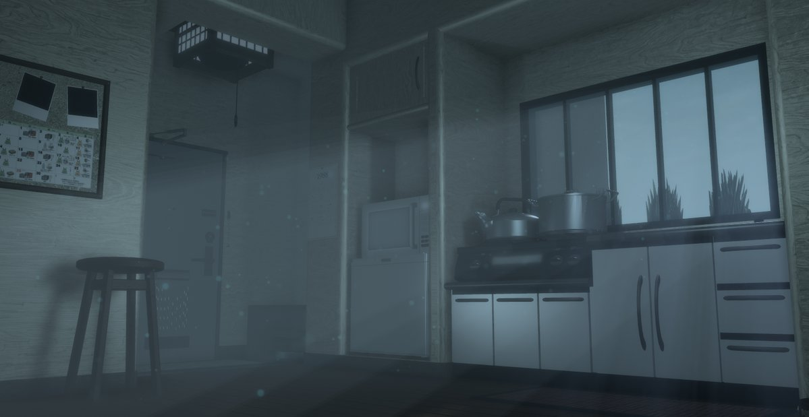</a>

<a href="images/results_12.jpg">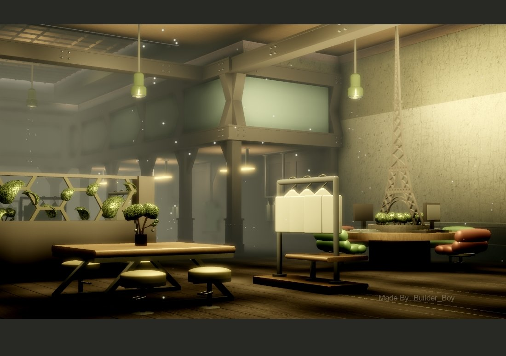</a>

<a href="images/results_13.jpg">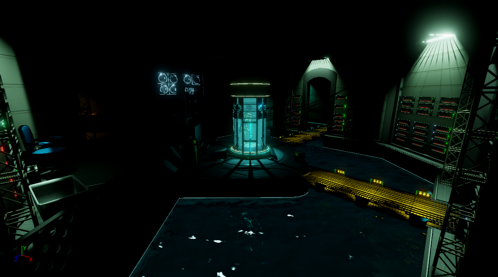</a>

<a href="images/results_14.jpg">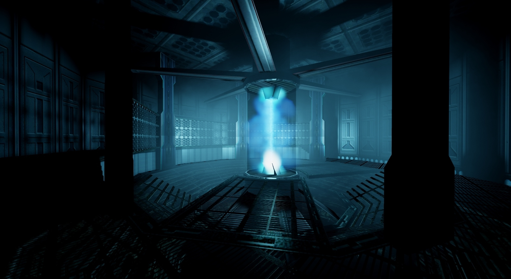</a>
